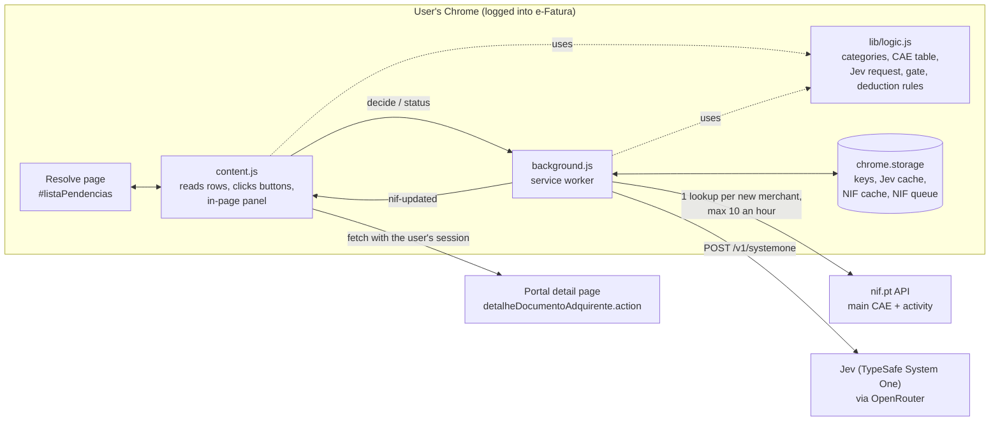
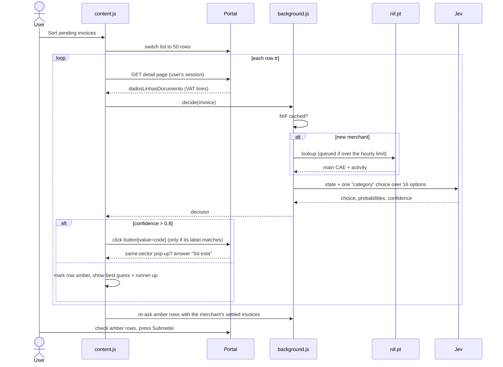
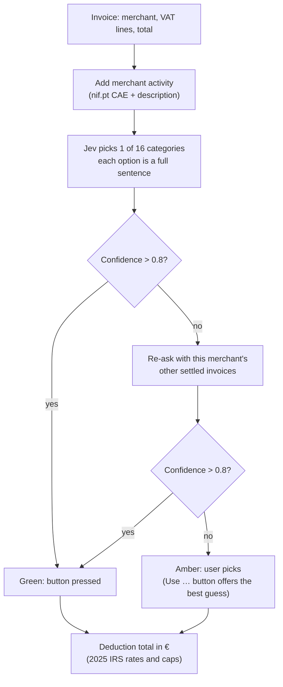

# Architecture

e-Fatura Rescue is a Chrome extension that runs on the portal's "resolver pendências" page. It works out the IRS category for each pending invoice, presses the category button when it's confident, and leaves the Submeter button to the user.

## Components

| Part | Job |
|---|---|
| `content.js` | Runs inside the portal page. Reads each invoice row, fetches its VAT lines, shows the panel, and clicks the category buttons. |
| `background.js` | Holds the API keys and makes every outside call (nif.pt and Jev). Caches the answers so repeat invoices cost nothing. |
| `lib/logic.js` | Shared, pure code: the 16 categories and their option sentences, the CAE table, how the Jev request is built and read, the 0.8 gate, and the 2025 deduction rules. |
| `demo/` | A bun server with a copy of the resolve page (`fixture.ts`) for the stage demo, plus `eval.ts` to measure Jev on the sample invoices. |

## How one invoice is sorted

## The decision

- **Jev writes no text.** The option sentence it picked is the reason shown to the user.
- **The date is left out of the Jev request**, so a repeat invoice (the same monthly pass) hits the cache.
- **Confident rows are never re-asked.** The same shop can sell a meal and a loaf of bread.

## Safety rules
- **Never presses Submeter.** The user submits.
- **Fails closed:** a button is clicked only if its label matches the expected category.
- **The user's own pick always wins.** A row the user already set is skipped.
- **Clicks run one at a time** so each same-sector pop-up is answered "Só esta" (`#oneBtn`). It never presses "Todas" (`#allBtn`), and a pop-up the user opens is left for the user.
- **No invoice data leaves the browser** except the fields sent to Jev, and the merchant NIF sent to nif.pt.

## Limits
- The portal lists only the 50 most recent pending invoices, so a larger backlog takes several passes.
- nif.pt's free key allows 10 lookups an hour. New merchants queue, and their amber rows are re-decided when the lookup arrives.
- Books, arts and museums (C13–C15) add €0 to the total until their deduction rates are confirmed.
